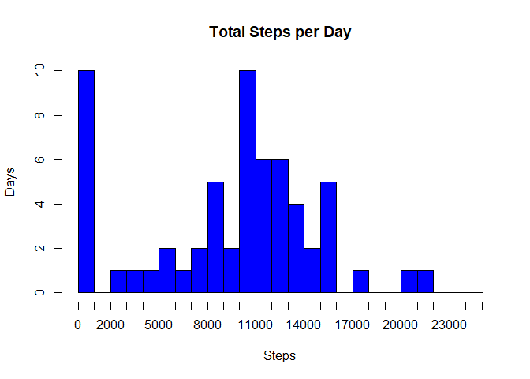
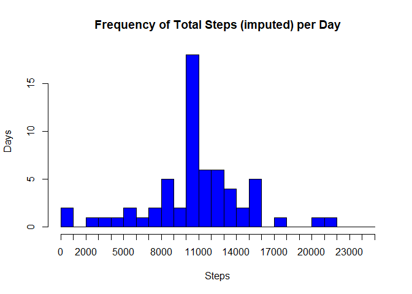
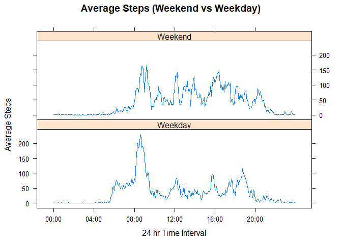

Markdown & knitr
================
July 12, 2017

Markdown & knitr Assignment
===========================

### Load Libraries

``` r
library(lattice)
library(knitr)
library(stringr)
```

### Set Global Options

``` r
opts_chunk$set(echo=TRUE,results="show",cache=TRUE)
```

### Set Directory

``` r
setwd("C:/Users/hussamzarea/Desktop/Coursera/markdown/Week2")
```

### 1. Code for reading in the dataset and/or processing the data

Create a data set from the activity.csv with "," separated columns and include the a header.

``` r
activityData <- read.table("activity.csv", 
                           header=TRUE, 
                           sep=",", 
                           stringsAsFactors = FALSE, 
                           colClasses = c("numeric","Date","numeric")
                           )
```

### 2. Histogram of the total number of steps taken each day

Create a histogram of the total steps per day

-   Create new data frame using the aggregate() function to total the steps per day and remove the na
-   Build teh histogram

``` r
#total steps
totalStepsPerDay <- aggregate(activityData$steps,
                              list(date=activityData$date),
                              sum,
                              na.rm=TRUE)

#xAxis range
xAxis = seq(from=0,to=25000,by=1000) 

#histogram
hist(totalStepsPerDay$x, 
     breaks = xAxis, 
     main="Total Steps per Day", 
     col="blue", 
     xlab="Steps", 
     ylab="Days", 
     xaxt="n") 

axis(side=1,at=xAxis,labels=xAxis)
```



### 3. Mean and median number of steps taken each day

``` r
meandStepOut <- paste("Mean number of steps per day:", 
                      round(mean(totalStepsPerDay$x, na.rm=T)
                            ,1)
                      )
medianStepOUt <- paste("Median number of steps per day:",
                       round(median(totalStepsPerDay$x,na.rm=T)
                             ,1)
                       )
```

#### Mean number of steps per day: 9354.2

#### Median number of steps per day: 10395

### 4. Time series plot of the average number of steps taken

First we need to create a data frame that has the average steps per interval across all days. Then can make a time series plot to see average activity rates throughout the day.

``` r
#Convert the 5-minute 24-hour clock intervals.

#get the hour only by extracting only the first 2 digits 
#add a leading 0 to the hour if less than 10 hour
intHours <- ifelse(activityData$interval %/% 100 < 10,
                   paste("0",activityData$interval %/% 100,
                         sep=""),
                   activityData$interval %/% 100)

#get the minut only by extracting only the first 2 digits
#add a leading 0 to the minuts if less thatn 10 minutes 
intMinutes <- ifelse(activityData$interval %% 100 < 10,
                     paste("0",activityData$interval %% 100,
                           sep=""),
                     activityData$interval %% 100)

#Concatonate the hour and minute and convert to time with strptime()
intTime <- strptime(paste(intHours,
                          ":",intMinutes,
                          sep=""),
                    format="%H:%M")

timeOnly <- paste(intHours
                  ,":",
                  intMinutes,sep="")

#get the new data set
activityData <- cbind(activityData,
                      intTime)

#plot the mean number of steps for each tim
plotMean<- aggregate(activityData$steps,
                 list(intTime=activityData$intTime),
                 mean,
                 na.rm=TRUE)

plot(plotMean$intTime,plotMean$x,
     type = "l",
     main = "Average Steps per Interval",
     xlab = "Interval",
     ylab = "Average Steps")
```


``` r
#get the hightest average interval
MaxStepAvg <- max(plotMean$x)
IntervalWithMaxStepAvg <- plotMean$intTime[plotMean$x == MaxStepAvg]

#remove the date from the string
IntervalWithMaxStepAvg <- str_replace_all(IntervalWithMaxStepAvg,
                                          "2017-07-12", "")
#round the hightest average
MaxStepAvg <- round(MaxStepAvg,digits=2) 
```

### 5. The 5-minute interval that, on average, contains the maximum number of steps

#### The highest average occurs at 08:35:00 and is equal to 206.17 steps.

#### a. Get the number of missing data in the dataset

``` r
countNAs <- sum(is.na(activityData$steps))
```

There are a total of 2304 missing values.

### 6. Code to describe and show a strategy for imputing missing data

``` r
#Rename column x and merge the average into the data frame by time
names(plotMean)[names(plotMean)=="x"] <- "avgIntervalSteps"
activityDataWithAvg <- merge(x=activityData,
                             y=plotMean,by="intTime",
                             all.x=TRUE)

#Now create another column that uses the steps, if available, and the avgIntervalSteps otherwise.
activityDataWithAvg$imputedSteps <- ifelse(is.na(activityDataWithAvg$steps),
                                           activityDataWithAvg$avgIntervalSteps,
                                           activityDataWithAvg$steps)
```

### 7. Histogram of the total number of steps taken each day after missing values are imputed

``` r
totalStepsPerDayImputed <- aggregate(activityDataWithAvg$imputedSteps,list(date=activityDataWithAvg$date),sum,na.rm=TRUE)
xAxis = seq(from=0,to=25000,by=1000) 
hist(totalStepsPerDayImputed$x,
      breaks = xAxis,
      main="Frequency of Total Steps (imputed) per Day",
      col="blue",
      xlab="Steps",
      ylab="Days",
      xaxt="n")

axis(side=1,at=xAxis,labels=xAxis)
```



``` r
meanStepImputed <- mean(totalStepsPerDayImputed$x,na.rm=T)
medianStepImputed <- median(totalStepsPerDayImputed$x,na.rm=T)
meanStepImputedOut <- paste("Mean steps per day is",round(meanStepImputed,2))
medianStepImputedOut <- paste("Median steps per day is",round(medianStepImputed,2))
```

#### Mean steps per day is 10766.19 compared to 9354.23 from the data set with missing data

#### Median steps per day is 10766.19 compared to 1.039510^{4} from the data set with missing data

The change is due to the size of the missing data, 2304 out of 17568 is missing data. That is about 13%. Using the mean to replace the missing data is not the best option.

### 8. Panel plot comparing the average number of steps taken per 5-minute interval across weekdays and weekends

``` r
activityDataWithAvg$weekday <- weekdays(activityDataWithAvg$date)
activityDataWithAvg$weekendFlag <- ifelse(activityDataWithAvg$weekday=="Saturday" | activityDataWithAvg$weekday=="Sunday",
                                          "Weekend",
                                          "Weekday")

#get the average steps ber day for weekend and weekdays
averageSteps2 <- aggregate(activityDataWithAvg$imputedSteps,
                  list(intTime=activityDataWithAvg$intTime,
                       weekendFlag=activityDataWithAvg$weekendFlag),
                  mean,
                  na.rm=TRUE)

#set up the sequence to appear on the x-axis
#(This is based on StackOverflow post 14243834)
xn <- seq(min(activityDataWithAvg$intTime),
          max(activityDataWithAvg$intTime),
          by="4 hour")

#Draw the plot with the x-axis in HH:MM format
xyplot(x~intTime|weekendFlag,
       data=averageSteps2,
       type="l",
       layout=c(1,2),
       xlab = "24 hr Time Interval",
       ylab = "Average Steps",
       main = "Average Steps (Weekend vs Weekday)",
       scales=list(
                    x=list(
                            at=xn,
                            labels=format(xn,"%H:%M")
                            )
                  )
        )
```


